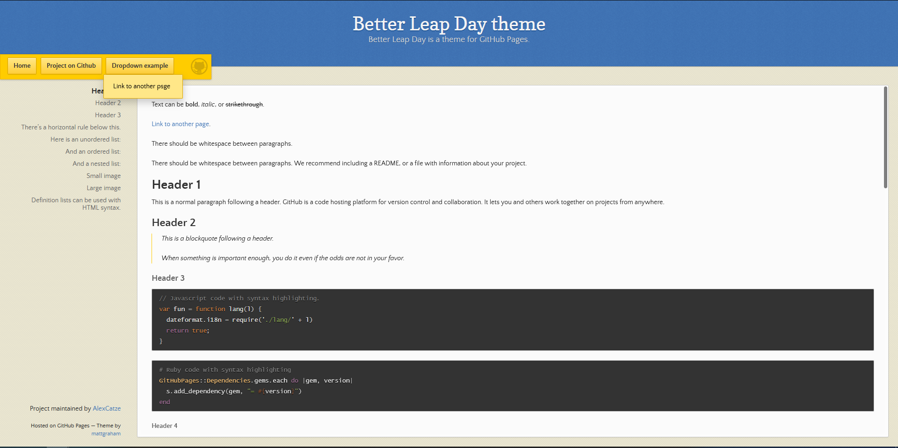

# The Better Leap Day theme

*Better Leap Day is a fork of Leap Day Jekyll theme for GitHub Pages. You can [preview the theme to see what it looks like](http://alexcatze.github.io/better-leap-day/), or even [use it today](#usage).*



## Usage

To use the Leap day theme:

1. Add the following to your site's `_config.yml`:

    ```yml
    remote_theme: alexcatze/better-leap-day
    plugins:
    - jekyll-remote-theme # add this line to the plugins list if you already have one
    ```
   Also You can specify version of theme using `@`. In example: `alexcatze/better-leap-day@0.2.0`;

2. Optionally, if you'd like to preview your site on your computer, add the following to your site's `Gemfile`:

    ```ruby
    gem "github-pages", group: :jekyll_plugins
    ```

## Customizing

### Configuration variables

Leap day will respect the following variables, if set in your site's `_config.yml`:

```yml
title: [The title of your site]
description: [A short description of your site's purpose]
```

Additionally, you may choose to set the following optional variables:

```yml
show_downloads: ["true" or "false" (unquoted) to indicate whether to provide a download URL]
google_analytics: [Your Google Analytics tracking ID]
```

### Setting up site menu

You can add 2 level menu on Your site with this theme by populating `_data/menu.yml` file. Example:


```yml
primary:
  - title: Main Menu
    subfolderitems:
      - name: "Home"
        url: "/"
      - name: "Project on Github"
        url: "https://github.com/AlexCatze/better-leap-day"
      - name: "Dropdown example"
        url: "#"
        subsubfolderitems:
          - name: "Link to another psge"
            url: "/another-page.html"
```

### Stylesheet

If you'd like to add your own custom styles:

1. Create a file called `/assets/css/style.scss` in your site
2. Add the following content to the top of the file, exactly as shown:
    ```scss
    ---
    ---

    @import "{{ site.theme }}";
    ```
3. Add any custom CSS (or Sass, including imports) you'd like immediately after the `@import` line

*Note: If you'd like to change the theme's Sass variables, you must set new values before the `@import` line in your stylesheet.*

### Layouts

If you'd like to change the theme's HTML layout:

1. For some changes such as a custom `favicon`, you can add custom files in your local `_includes` folder. The files [provided with the theme](https://github.com/AlexCatze/better-leap-day/tree/master/_includes) provide a starting point and are included by the [original layout template](https://github.com/AlexCatze/better-leap-day/tree/master/_layouts/default.html).
2. For more extensive changes, [copy the original template](https://github.com/AlexCatze/better-leap-day/tree/master/_layouts/default.html) from the theme's repository<br />(*Pro-tip: click "raw" to make copying easier*)
3. Create a file called `/_layouts/default.html` in your site
4. Paste the default layout content copied in the first step
5. Customize the layout as you'd like

### Customizing Google Analytics code

Google has released several iterations to their Google Analytics code over the years since this theme was first created. If you would like to take advantage of the latest code, paste it into `_includes/head-custom-google-analytics.html` in your Jekyll site.

## Project philosophy

The Better Leap Day theme is my fork of Leap Day with some improvements. The goal of this project is creating detter version of Leap Day.

## Contributing

Interested in contributing to Better Leap Day? We'd love your help. Leap day is an open source project, built one contribution at a time by users like you. See [the CONTRIBUTING file](docs/CONTRIBUTING.md) for instructions on how to contribute.

### Previewing the theme locally

If you'd like to preview the theme locally (for example, in the process of proposing a change):

1. Clone down the theme's repository (`git clone https://github.com/pages-themes/leap-day`)
2. `cd` into the theme's directory
3. Run `script/bootstrap` to install the necessary dependencies
4. Run `bundle exec jekyll serve` to start the preview server
5. Visit [`localhost:4000`](http://localhost:4000) in your browser to preview the theme
